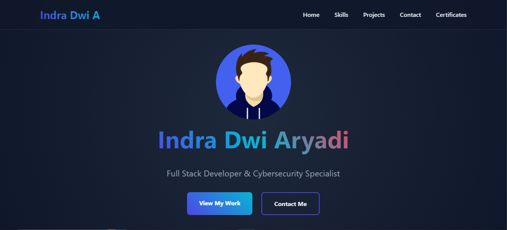

# Modern Portfolio Website



A modern, responsive portfolio website built with HTML, CSS, and JavaScript, featuring interactive animations, and dynamic content loading.

## ✨ Features

- **Responsive Design** - Optimized for all screen sizes
- **Interactive UI** - Smooth animations and transitions
- **Particle.js Background** - Interactive particle animation
- **Skill Progress Bars** - Animated skill visualization
- **Certificate Gallery** - Modal view for certificates
- **Contact Form** - Integrated email contact form
- **Scroll Progress** - Visual progress indicator
- **Image Lazy Loading** - Optimized image loading

## 🚀 Technologies Used

- HTML5
- CSS3 (Custom Properties, Flexbox, Grid)
- JavaScript (ES6+)
- Particle.js
- AOS (Animate On Scroll)
- FontAwesome Icons

## 🛠️ Installation & Setup

1. Clone the repository:
```bash
git clone https://github.com/yourusername/portfolio-website.git
```

2. Navigate to project directory:
```bash
cd portfolio-website
```

3. Install dependencies:
```bash
npm install
```

4. Start the development server:
```bash
npm start
```

## 📂 Project Structure

```
portfolio-website/
├── index.html
├── assets/
│   ├── css/
│   │   └── style.css
│   ├── js/
│   │   └── email.js
│   │   └── particle-js-aos.js
│   │   └── year-image-certificate.js
│   └── images/
│       ├── person.png
│       ├── project-1.jpg
│       ├── project-2.jpg
│       ├── certificate-1.jpg
│       └── certificate-2.jpg
└── README.md
```

## 🎨 Customization

### Theme Colors

You can customize the theme colors by modifying the CSS variables in the `:root` selector:

```css
:root {
    --primary: #4f46e5;
    --secondary: #06b6d4;
    --accent: #f43f5e;
    --background: #0f172a;
    --surface: #1e293b;
    --text: #e2e8f0;
}
```

### Particle.js Configuration

Modify the particle animation by adjusting the configuration in `particle-js-aos.js`:

```javascript
particlesJS('particles-js', {
    particles: {
        number: {
            value: 80,
            density: {
                enable: true,
                value_area: 800
            }
        },
        // ... other options
    }
});
```

## 📱 Responsive Breakpoints

The website is responsive with the following breakpoints:

- Mobile: < 480px
- Tablet: 480px - 768px
- Desktop: > 768px

## 🔒 Security Features

- Form validation and sanitization
- Protected email address (Base64 encoded)
- Disabled right-click context menu
- Secure external links

## 📄 License

This project is licensed under the MIT License - see the [LICENSE](LICENSE) file for details.

## 🤝 Contributing

1. Fork the repository
2. Create your feature branch (`git checkout -b feature/AmazingFeature`)
3. Commit your changes (`git commit -m 'Add some AmazingFeature'`)
4. Push to the branch (`git push origin feature/AmazingFeature`)
5. Open a Pull Request

## 📧 Contact

Your Name - [your@email.com](mailto:xnuversh1kar4@gmail.com)

Project Link: [https://github.com/Xnuvers007/portfolio](https://github.com/Xnuvers007/portfolio)

## 🙏 Acknowledgments

- [Particle.js](https://vincentgarreau.com/particles.js/)
- [AOS Library](https://michalsnik.github.io/aos/)
- [FontAwesome](https://fontawesome.com/)
- [GSAP](https://greensock.com/gsap/)

## 🌟 Show Your Support

Give a ⭐️ if you found this project helpful!
    
# Thanks to

- Allah SWT.
- Rasulullah SAW.
- My family.
- My friends.
- My teacher.
- My Girlfriend.
- And you.